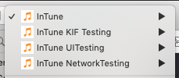

# In Tune

## Outline

The app searches the [iTunes API](https://developer.apple.com/library/archive/documentation/AudioVideo/Conceptual/iTuneSearchAPI/Searching.html#//apple_ref/doc/uid/TP40017632-CH5-SW1) and lists out the results in a table. It can play the previews continuously in a playlist. Tap on one, and it keeps going. It plays in the background too! Nice.

Selecting sort gives options to sort the results according to artist, album, price, length, genre, and year.

Tap an item to show more details. Here you can also open the track directly in iTunes Music (Apple Music subscription required). The music player at the base of the screen plays the preview. Share the track details to any supported services and social media. 

On selecting the detail view, all the results are added to the music player queue, tap on play and it will continue to play all the previews.

On returning to the search screen, the music player will still be visible on top of the results table (with a small touch of blur).

## Architecture 

At the root level, the application employs the [coordinator pattern](http://khanlou.com/2015/01/the-coordinator/) to remove the dependency between screens, enabling better reusability and testability. 

The presentation layer uses the well-known [Model-View-Presenter pattern](https://en.wikipedia.org/wiki/Model–view–presenter), giving a clean seperation of concerns between the view, state and the data.

A wireframe structure is used to manage the dependency injection in the view controller and presenter.

The data provider class acts as a data access layer, which has extensions defined by protocols for each screen and the music player. This ensures that access to functions are restricted, and it facilitates unit and integration testing by mocking the data layer.

An AppData class is used to maintain global state across screens, with the data provider controling its access. View controllers have read-only access, and data must be updated via actions. This is a form of uni-directional data flow that helps prevent inconsistencies in the screens and the data presented. 

## Implementation 

The coordinator is in charge of what is displayed on the screen. The player view is added and controlled independently of the 2 screens, and is managed by the coordinator. 

The scrolling of the results is optimised by performing all the necessary parsing of data into an array of structures prior to displaying them. The artwork images are loaded asynchronously and cached. 
	
The player is based around the [AVQueuePlayer](https://developer.apple.com/documentation/avfoundation/avqueueplayer) class. It takes an array of [AVPlayerItems](https://developer.apple.com/documentation/avfoundation/avplayeritem) as an input, and can play the next item once one finishes. It does not support going back to the previous item however. This has been implemented by deleting the queue of player items, and building it back again placing the new item at the beginning. 

On loading player items, an asychronous caching process is done to preload the metadata which results in smooth playback of the queue.

## Integrations

The project is integrated with both [Travis](https://travis-ci.org) and [Circle](https://circleci.com) for continuous integration. 

Code quality checking is run by using [SwiftLint](https://github.com/realm/SwiftLint), and is integrated with [CodeBeat](https://codebeat.co) for more fine-grained analysis. 

[CodeCov](https://codecov.io) is integrated to validate and give reporting on the unit and integration test coverage.

## Automated testing
The project has unit, integration and UI tests. The UI tests are implemented using both the Xcode standard UI test as well as [KIF](https://github.com/kif-framework/KIF). 

The project has 4 schemes that separate out the different types of testing. 

The main scheme supports the standard XCTestCase tests. [KIF](https://github.com/kif-framework/KIF) testing is separated out primerily due to the know issues of it failing when run on the CI server. The UI Testing scheme only runs the XCode UI tests. The network testing scheme takes advantge of the [Moya](https://github.com/Moya/Moya) plugin to enable network logging as defined in the [SearchiTunesService](https://github.com/ronanociosoig/inTune/blob/develop/InTune/Services/Networking/SearchiTunesService.swift) class.

## Known Issues
The player does not behave correctly when running in the simulator. Tapping pause does not always pause the current song. It works perfectly on the device.

Running all the KIF tests at once will fail The problematic ones are when the AVPlayer is used. Running them separately works. 

There seems to be a memory leak related to the UI keyboard prediction view.

## Improvements

It would be nice to add: 

- Force touch to the search results, and to the music player view.

- Favorits list. 

- Search history. 

- Open song preview pages. 

- Show currently playing song in the search results with a progress. 

- Filter results to get a more accurate results list.
